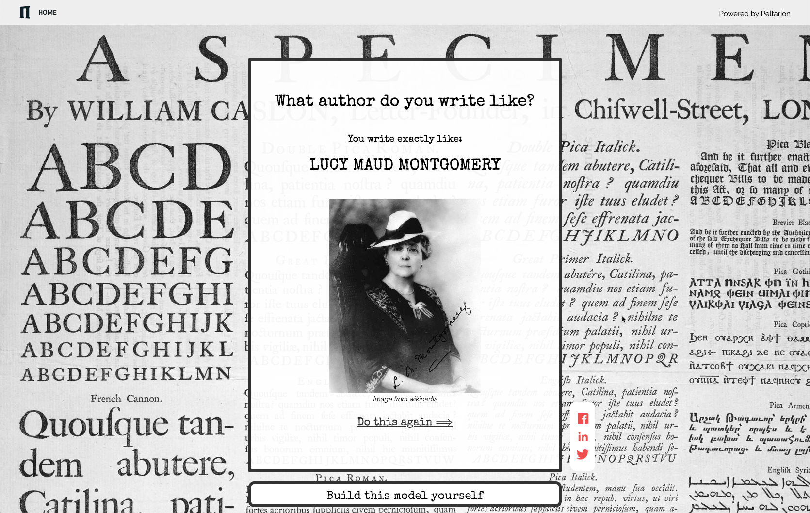

# Author style

This repo includes everything you need to build a web app for Peltarion's tutorial [Author style predictor](https://peltarion.com/knowledge-center/tutorials/author-style-predictor).
In this tutorial, we’ll show you how to use our platform to build a deep learning model on your own and figure out which Nobel laureate you were in your past life!

**The tutorial will teach you how to**
* Build, train, and deploy a BERT model in the Peltarion Platform.
* Create a web app that can decide which author a piece of text could have been written by.

## Create a web app - use the model

When you have built, trained, and deployed a model with the Peltarion platform, you can use the content in this repo to create a web app that uses the model. 

The idea is that the app will display a simple web page with a text area and a submit button. The aspiring writer submits some text, clicks the submit button, and gets a response page stating which author could have written the text. Simple but effective! 

## Test our version of the web app

If you want to try out our version of the app - get into the mood with hot chocolate and a candle... then open the app [https://author-style.demo.peltarion.com](author-style.demo.peltarion.com) and write a few sentences right from your mind or heart. (ok, if creativity is zero it's perfectly fine to copy something from Google). Then - push the button and check your writing... Surprised? Honored? Terrified? 

## Sign up 
If you don't have an account on the Peltarion Platform yet, here's where you [sign up](https://peltarion.com/signup). It's all free and you get instant access
